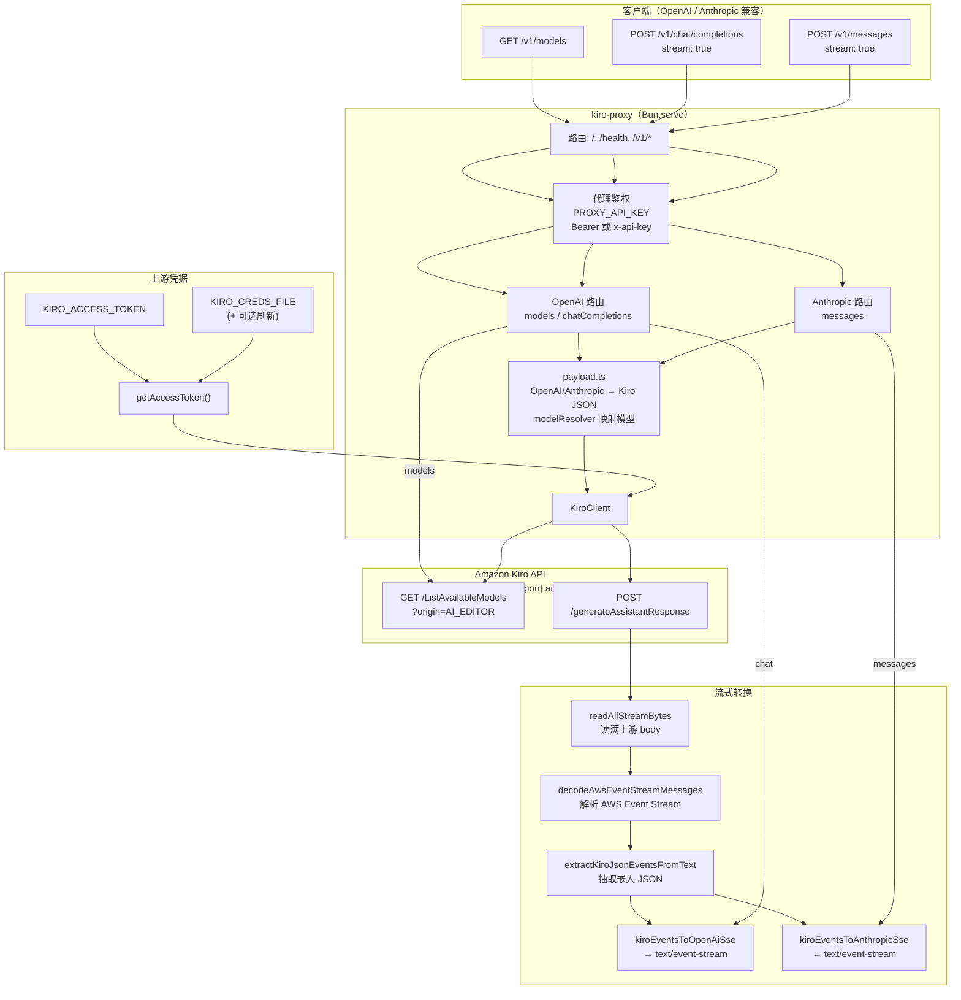

<div align="center">

# kiro-proxy

**本地 Kiro API 代理网关（OpenAI / Anthropic 兼容端点）**

基于 [Bun](https://bun.com) 与 `Bun.serve()`。

*适用于在 IDE/CLI 中用 OpenAI / Anthropic SDK 对接 Kiro 的流式能力（SSE）。*

[功能](#-功能特性) • [架构](#整体架构) • [快速开始](#-快速开始) • [打包二进制](#打包为二进制独立可执行文件) • [配置](#%EF%B8%8F-配置) • [Claude Code](#claude-code-集成) • [端点](#-端点) • [示例](#-最小调用示例curl) • [测试](#-测试) • [文档](#-文档)

</div>

---

## ✨ 功能特性

| 功能 | 描述 |
|------|------|
| 🔌 **OpenAI 兼容端点** | `POST /v1/chat/completions`（仅 `stream: true`） |
| 🔌 **Anthropic 兼容端点** | `POST /v1/messages`（仅 `stream: true`） |
| 📡 **SSE 流式转发** | 上游 EventStream → 映射为 OpenAI/Anthropic SSE |
| 🔐 **代理鉴权** | 支持 `Authorization: Bearer ...` 与 `x-api-key` |
| 🪪 **上游凭据两种来源** | `KIRO_ACCESS_TOKEN` 或 `KIRO_CREDS_FILE` |

---

## 整体架构

客户端使用 OpenAI / Anthropic 兼容 API；代理校验 `PROXY_API_KEY` 后，将请求映射为 Kiro 上游格式，并用 Kiro access token 调用 `https://q.{region}.amazonaws.com`。流式路径：上游返回 **AWS Event Stream** → 解码 → 抽取内嵌 JSON → 输出 **OpenAI 或 Anthropic 风格 SSE**。



---

## 🚀 快速开始

### 前置要求

- Bun

### 安装依赖

```bash
bun install
```

### 启动（推荐：使用 `KIRO_CREDS_FILE`）

```bash
PROXY_API_KEY=your-secret \
KIRO_CREDS_FILE="/path/to/kiro-creds.json" \
bun run index.ts
```

### 启动（直连：`KIRO_ACCESS_TOKEN`）

> 设置 `KIRO_ACCESS_TOKEN` 后会绕过凭据文件读取/刷新/阈值逻辑。

```bash
PROXY_API_KEY=your-secret \
KIRO_ACCESS_TOKEN="eyJ..." \
bun run index.ts
```

默认监听 `0.0.0.0:18000`。

### 打包为二进制（独立可执行文件）

使用 Bun 将入口打成**单文件可执行程序**（内嵌运行时，目标机无需安装 Bun）：

```bash
bun run build:binary
```

产物写入 `dist/kiro-proxy`（在 Windows 上通常为 `dist/kiro-proxy.exe`）。`dist/` 已列入 `.gitignore`。

运行方式与 `bun run index.ts` **相同**：仍需 `PROXY_API_KEY` 等环境变量（见下方 [配置](#%EF%B8%8F-配置)），例如：

```bash
PROXY_API_KEY=your-secret \
KIRO_CREDS_FILE="/path/to/kiro-creds.json" \
./dist/kiro-proxy
```

**`.env`**：Bun 会在**当前工作目录**自动加载 `.env`；把二进制放到任意目录执行时，请在该目录放置 `.env`，或由 systemd、Docker、launchd 等注入环境变量。无需随二进制分发 `node_modules`。

在另一平台出包时，可在本机使用 `--target`（具体取值以 `bun build --help` 为准），例如：

```bash
bun build --compile ./index.ts --outfile=dist/kiro-proxy-linux --target=bun-linux-x64
```

---

## 🪵 日志与排错

启动成功会打印一条 `server_started`，并明确列出支持的 endpoints：

- `GET /v1/models`
- `POST /v1/chat/completions`（仅 `stream: true`）
- `POST /v1/messages`（仅 `stream: true`）

每个请求都会输出 `request_start` / `request_end`；若 `status >= 400` 会额外输出 `request_diagnostics`（包含建议排查方向）；若代码抛异常则输出 `request_error`（含堆栈，鉴权头会自动打码）。

常见定位思路：

- `server_start_failed` + `Missing required env var: PROXY_API_KEY`：服务**未启动**，先设置 `PROXY_API_KEY` 再启动。
- `request_diagnostics` status=401：代理鉴权失败，检查 `Authorization: Bearer ...` / `x-api-key` 是否匹配 `PROXY_API_KEY`。
- `request_diagnostics` status=503：上游凭据缺失/无效，检查 `KIRO_ACCESS_TOKEN` 或 `KIRO_CREDS_FILE`。
- `upstream_response` status>=400：来自 Kiro 上游的错误，日志会包含 `status`、`contentType`、以及 `errorSnippet`（前 2000 字符）。

---

## ⚙️ 配置

### 环境变量

| 变量 | 说明 | 默认 |
|------|------|------|
| `PROXY_API_KEY` | 代理 API 密钥（Bearer 或 `x-api-key`） | （必填） |
| `SERVER_HOST` | 监听地址 | `0.0.0.0` |
| `SERVER_PORT` | 端口 | `18000` |
| `KIRO_REGION` | Kiro 区域 | `us-east-1` |
| `TOKEN_REFRESH_THRESHOLD_SECONDS` | 仅在使用 `KIRO_CREDS_FILE` 时生效：在 access token 到期前多少秒开始尝试刷新 | `600` |
| `KIRO_ACCESS_TOKEN` | 直连 Kiro access token；若设置则**不**读凭据文件，且**不**应用下方阈值与进程内刷新 | — |
| `KIRO_CREDS_FILE` | Kiro 凭据 JSON 路径；未设 `KIRO_ACCESS_TOKEN` 时由进程内 `KiroAuthManager` 加载，并按 `TOKEN_REFRESH_THRESHOLD_SECONDS` 在到期前尝试刷新、原子回写同一文件。未设置该变量时，若存在默认文件 `~/.aws/sso/cache/kiro-auth-token.json` 则会自动使用（支持 `~` 展开）；若默认文件不存在则视为未配置凭据 | — |

---

## Claude Code 集成

[Claude Code](https://code.claude.com/docs) 走 Anthropic 兼容 API 时，可通过环境变量把请求发到本代理。请先在本机启动 `kiro-proxy`（并配置好 `KIRO_ACCESS_TOKEN` 或 `KIRO_CREDS_FILE` 等上游凭据）。

### 与 `PROXY_API_KEY` 的对应关系

| 环境变量 | 作用 |
|----------|------|
| `ANTHROPIC_BASE_URL` | API 基地址，例如 `http://127.0.0.1:18000`（端口需与 `SERVER_PORT` 一致，默认 `18000`） |
| `ANTHROPIC_API_KEY` | 与本机启动代理时使用的 **`PROXY_API_KEY` 相同**；Claude Code 会以 `X-Api-Key` 发出，本代理亦接受 `Authorization: Bearer`（也可用官方文档中的 `ANTHROPIC_AUTH_TOKEN` 走 Bearer） |

变量可在启动 `claude` 前用 shell `export`，或写入 Claude Code 的 [`settings.json` 中 `env` 字段](https://code.claude.com/docs/en/settings)，使每次会话自动带上。完整列表见 [Claude Code 环境变量](https://code.claude.com/docs/en/env-vars)。

### 仅当前仓库生效（推荐）

在**项目根**创建 `.claude/settings.local.json`（个人覆盖、通常不提交），例如：

```json
{
  "$schema": "https://json.schemastore.org/claude-code-settings.json",
  "env": {
    "ANTHROPIC_BASE_URL": "http://127.0.0.1:18000",
    "ANTHROPIC_API_KEY": "与 PROXY_API_KEY 相同"
  }
}
```

### 全局默认

若希望所有项目默认指向本机代理，可将同一组 `env` 写入 `~/.claude/settings.json`。多份配置并存时的优先级见 [Configuration scopes](https://code.claude.com/docs/en/settings#configuration-scopes)（Local > Project > User）。

### 可选：网关与 `anthropic-beta` 头

若代理或上游对 `anthropic-beta` 等请求头报错，可在 `env` 中增加 `CLAUDE_CODE_DISABLE_EXPERIMENTAL_BETAS`（值为 `1`），说明见官方 [env 文档](https://code.claude.com/docs/en/env-vars)。

### 说明

- **`ANTHROPIC_BASE_URL`** 指向本项目的 **API 网关**；与系统级 **`HTTP_PROXY` / `HTTPS_PROXY`**（公司 HTTP 代理）不是同一类配置。
- 非官方主机时 Claude Code 对 MCP tool search 等行为可能有默认差异，详见官方文档中的 `ANTHROPIC_BASE_URL` 与 `ENABLE_TOOL_SEARCH` 说明。

---

## 📌 关键契约（请先读这一段）

- **代理鉴权**：客户端调用需携带代理密钥，支持：
  - `Authorization: Bearer <PROXY_API_KEY>`
  - `x-api-key: <PROXY_API_KEY>`
- **仅支持流式**：`/v1/chat/completions` 与 `/v1/messages` 仅在 `stream: true` 时工作；非流式返回 `501`。
- **未配置/无法读取上游凭据**：流式请求会返回 `503`（OpenAI/Anthropic 的错误 JSON 形状不同）。
- **凭据优先级**：`KIRO_ACCESS_TOKEN` > `KIRO_CREDS_FILE`；设置 `KIRO_ACCESS_TOKEN` 会绕过文件读取/刷新/阈值逻辑。
- **上游非 2xx**：当前实现通常会**透传** `status + body(text)`，不保证 OpenAI/Anthropic 标准错误 JSON（也不保证 `content-type`）。

---

## 📡 端点

| 端点 | 方法 | 描述 |
|------|------|------|
| `/v1/models` | GET | 需代理密钥；若已配置 Kiro token，则请求上游 `ListAvailableModels`，否则返回空列表 |
| `/v1/chat/completions` | POST | OpenAI 兼容；需 `model` 与 `messages`；仅 `stream: true`（否则 `501`） |
| `/v1/messages` | POST | Anthropic 兼容；需 `model`、`max_tokens`、`messages`；仅 `stream: true`（否则 `501`） |

未配置 `KIRO_ACCESS_TOKEN` 或 `KIRO_CREDS_FILE` 时，流式请求会返回 `503`（并提示未配置凭据）。

---

## 💡 最小调用示例（curl）

> 流式请求建议使用 `curl -N`（禁用输出缓冲，便于观察 SSE 持续输出）。

### models

```bash
curl -sS \
  -H "Authorization: Bearer $PROXY_API_KEY" \
  "$BASE_URL/v1/models"
```

### OpenAI 流式

```bash
curl -N \
  -H "Authorization: Bearer $PROXY_API_KEY" \
  -H "Content-Type: application/json" \
  "$BASE_URL/v1/chat/completions" \
  -d '{"model":"x","stream":true,"messages":[{"role":"user","content":"hi"}]}'
```

### Anthropic 流式

```bash
curl -N \
  -H "x-api-key: $PROXY_API_KEY" \
  -H "Content-Type: application/json" \
  "$BASE_URL/v1/messages" \
  -d '{"model":"x","stream":true,"max_tokens":64,"messages":[{"role":"user","content":[{"type":"text","text":"hi"}]}]}'
```

---

## 🚨 错误码速查

| 状态码 | 常见原因 | 怎么做 |
|---|---|---|
| `401` | 代理密钥错误/缺失 | 检查 `Authorization: Bearer ...` 或 `x-api-key` 是否匹配 `PROXY_API_KEY` |
| `501` | 非流式请求（`stream !== true`） | 对 `chat/messages` 设置 `stream: true` |
| `503` | 未配置/无法读取上游凭据（如缺少 `KIRO_ACCESS_TOKEN`/`KIRO_CREDS_FILE`，或 creds 文件无效/缺字段） | 配置上游凭据；检查 creds 文件内容与路径；注意 OpenAI/Anthropic 错误体形状不同 |
| `403` | 上游 token 无效/过期（来自上游） | 更新/刷新上游凭据；注意当前实现可能透传上游 `status + text` |
| `400` | JSON 不合法/缺字段，或请求打到旧进程 | 检查请求体字段；若出现 `Improperly formed request`，先确认端口监听进程并重启 |

---

## 🧪 测试

```bash
bun test
```

<details>
<summary><b>真实联调（live smoke）</b></summary>

先启动服务（示例用本地凭据文件）：

```bash
PROXY_API_KEY=dev-secret \
KIRO_CREDS_FILE="/Users/mamba/.aws/sso/cache/kiro-auth-token.json" \
bun run index.ts
```

另开一个终端执行：

```bash
chmod +x ./smoke-live.sh
BASE_URL=http://127.0.0.1:18000 PROXY_API_KEY=dev-secret ./smoke-live.sh
```

也可以直接用 Bun script：

```bash
BASE_URL=http://127.0.0.1:18000 PROXY_API_KEY=dev-secret bun run smoke:live
```

脚本会依次验证：
- `GET /v1/models`
- `POST /v1/chat/completions`（stream）
- `POST /v1/messages`（stream）

</details>

<details>
<summary><b>常见联调问题</b></summary>

- `401`：代理密钥错误（`Authorization: Bearer ...` 或 `x-api-key` 不匹配）。
- `503`：未配置 `KIRO_ACCESS_TOKEN`/`KIRO_CREDS_FILE`。
- `403 invalid bearer token`：上游 token 无效或过期。
- `400 Improperly formed request`：很可能打到了旧进程；先确认端口监听进程并重启。

快速排查端口占用：

```bash
lsof -nP -iTCP:18000 -sTCP:LISTEN
```

</details>

---

## 📚 文档

- `docs/auth-and-creds.md`：鉴权与凭据（含 `KIRO_CREDS_FILE` 字段分层）
- `docs/api-compat.md`：对外 API 兼容与错误体形状
- `docs/model-mapping.md`：客户端 `model` → Kiro `modelId` 与 `/v1/models` 列表映射
- `docs/streaming.md`：流式（SSE）调试要点
- `docs/development.md`：开发/测试/live smoke/排错
